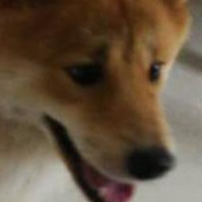
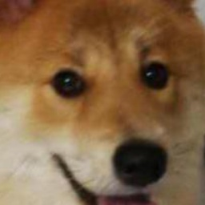
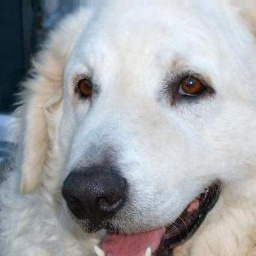
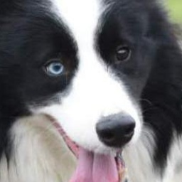

# Dog Dataset
The dataset consits of ~22k images of predominately front facing dog heads with a size of 256x256 pixels. It was derived from the [Tsinghua Dog Dataset](https://cg.cs.tsinghua.edu.cn/ThuDogs/).

## How can I use the dataset?
1. Download the Tsinghua Dog Dataset [here](https://cg.cs.tsinghua.edu.cn/ThuDogs/).
2. Install libs for preprocessing: `pip install -r requirements.txt`
3. Switch to scripts folder: `cd scripts`
4. Run preprocessing steps 1-3: `python step_1.py` etc.
5. Alternatively you can start a jupyter notebook and run the provided notebooks: `jupyter-lab`.

### Preprocessing details
- During **step 1** images are cropped according to bounding boxes provided by Tsinghua Dogs Dataset creators.
- During **step 2** a second dog face detector is used to extract more accurate bounding boxes and key frames (eyes, nose, forehead). Both are used to refine the final cropped image. In addition, small images and images showing a dog from the side are filtered out.
- During **step 3** the dataset is split into a train and validation set.

### Example images

